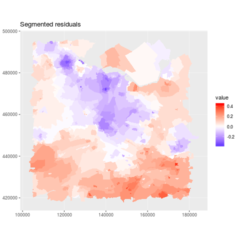

# graphseg: segmentation of a graph-based signal

## What this package does
Performs estimation of a signal with regularization using the adjacency structure.
This package has a natural application to spatial data: when we want to have a spatial segmentation of a region-dependent signal, you can apply this package to the adjacency graph of the spatial regions.

This package uses a penalty similar to the graph fused lasso [[1]](https://arxiv.org/pdf/0910.0526.pdf), except that the penalty on difference between adjacent vertices is given by the adaptive ridge ([[2]](http://downloads.hindawi.com/journals/cmmm/2016/3456153.pdf),  [[3]](https://www.ncbi.nlm.nih.gov/pmc/articles/PMC4743917/pdf/pone.0148620.pdf)).
More information are given in a preprint to be available soon.

## Illustration of the package:
Here is a small example of segmentation of obesity prevalence [[4]](https://ij-healthgeographics.biomedcentral.com/track/pdf/10.1186/s12942-017-0097-5) on spatial data from the region of Utrecht, Netherlands.
Each administrative region is a vertex of the graph and the edges are given by the presence of a shared border between two regions.




## How to install the package
## Installation
You can install the `graphseg`package directly from GitHub, which is the recommended option. Alternatively, you can also install this package by hand. Details are given hereafter.

### Recommended installation
1. Execute in `R`:

```
install.packages("devtools")   
devtools::install_github("goepp/graphseg")
```

2. If `R` asks you which package you would like to update, there should be no need to update them: answer "None". If this breaks the package or prevents it from running, please [contact me](https://github.com/goepp/graphseg#contact).

### By-hand installation
1. Click "Clone or Download" > "Download ZIP" to download the file "graphseg-master.zip"
2. Unzip the zip file and rename the output folder "graphseg-master" to "graphseg"
3. Open a terminal in the folder where "graphseg" is, and execute:

```
R CMD build graphseg  
```

This builds the package, which is now present in the same folder, under the name "graphseg_0.1.0.tar.gz" (version number may be different).

4. Install the package in `R`:
```
setwd("path/to/the/graphseg/package")   
install.packages("graphseg_0.1.0.tar.gz", repos = NULL)
```
Your package should now be installed!

## Contact
A problem or suggestion? Feel free to make a pull request or to email me (see my contact details on [my webpage](https://goepp.github.io))

## License
This package is released under the GPLv3 License: see the `LICENSE` file or the [online text](https://www.gnu.org/licenses/gpl-3.0.en.html). In [short](https://tldrlegal.com/license/gnu-general-public-license-v3-(gpl-3)#summary), you can use, modify, and distribute (including for commerical use) this package, with the notable obligations to use the GPLv3 license for your work and to provide a copy of the present source code.

## References

- [1]: Hoefling, H. (2010), *A Path Algorithm for the Fused Lasso Signal Approximator*, Journal of Computational and Graphical Statistics 19(4), 984-1006
- [2]: Liu, Z. and Li, G. (2016), *Efficient Regularized Regression with L0 Penalty for Variable Selection and Network Construction*, Computational and Mathematical Methods in Medicine, 1-11
- [3]: Frommlet, F. and Nuel, G. (2016), *An Adaptive Ridge Procedure for L0 Regularization*, PLoS ONE 11(2), e0148620
- [4]: van de Kassteele, J., Zwakhals, L., Breugelmans, O. and Ameling, C., and van den Brink, C. (2017), *Estimating the Prevalence of 26 Health-Related Indicators at Neighbourhood Level in the Netherlands Using Structured Additive Regression*, International Journal of Health Geographics 16

