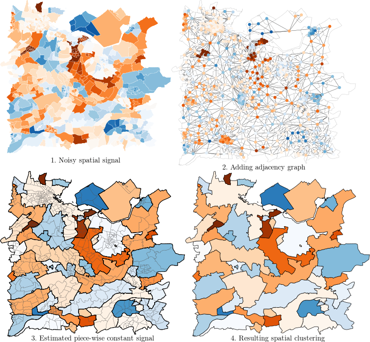

# graphseg: segmentation of graph-based signals

[](https://cran.r-project.org/package=graphseg)

## What this package does
Performs estimation of a signal with regularization using the adjacency structure.
This package has a natural application to spatial data: when we want to have a spatial segmentation of a region-dependent signal, you can apply this package to the adjacency graph of the spatial regions.
More information in the [associated paper](https://doi.org/10.48550/arXiv.2206.06752).

This package uses a penalty similar to the graph fused lasso (Hoefling, 2010), except that the penalty on differences between adjacent vertices is given by the adaptive ridge (Liu and Li 2016;  Frommlet and Nuel, 2016).

## Illustration
Here is a small example of segmentation of obesity prevalence on spatial data from the region of Utrecht, Netherlands (van de Kassteele et al, 2017).
Each administrative region is a vertex of the graph and the edges are given by the presence of a shared border between two regions.
This is illustrated by the figure:



## Installation
- The package can be downloaded from CRAN:
```
install.packages("graphseg")
```

- Alternatively, the development version of the package can be downloaded from this repo:
```
# install.packages("remotes")
remotes::install_github("goepp/graphseg")
```

## Bug report
If you have a problem or suggestion of improvement, please [raise an issue](https://github.com/goepp/graphseg/issues).

## License
This package is released under the GPLv3 License: see the `LICENSE` file or the [online text](https://www.gnu.org/licenses/gpl-3.0.en.html). In [short](https://tldrlegal.com/license/gnu-general-public-license-v3-(gpl-3)#summary), you can use, modify, and distribute (including for commerical use) this package, with the notable obligations to use the GPLv3 license for your work and to provide a copy of the present source code.

## References

- [0]: Goepp, V. and van de Kassteele, J. (2022). *Graph-Based Spatial Segmentation of Health-Related Areal Data.*, arXiv, [link](https://doi.org/10.48550/arXiv.2206.06752)
- [1]: Hoefling, H. (2010), *A Path Algorithm for the Fused Lasso Signal Approximator*, Journal of Computational and Graphical Statistics 19(4), 984-1006, [link](https://doi.org/10.1198/jcgs.2010.09208)
- [2]: Liu, Z. and Li, G. (2016), *Efficient Regularized Regression with L0 Penalty for Variable Selection and Network Construction*, Computational and Mathematical Methods in Medicine, 1-11, [link](https://doi.org/10.1155/2016/3456153)
- [3]: Frommlet, F. and Nuel, G. (2016), *An Adaptive Ridge Procedure for L0 Regularization*, PLoS ONE 11(2), e0148620, [link](https://doi.org/10.1371/journal.pone.0148620)
- [4]: van de Kassteele, J., Zwakhals, L., Breugelmans, O. and Ameling, C., and van den Brink, C. (2017), *Estimating the Prevalence of 26 Health-Related Indicators at Neighbourhood Level in the Netherlands Using Structured Additive Regression*, International Journal of Health Geographics 16, [link](https://doi.org/10.1186/s12942-017-0097-5)

